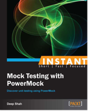

##Using Spock with PowerMock

This repository uses the example code from the excellent book "Mock Testing with PowerMock" where the JUnit test have been implemented with the Spock testing framework.

In some cases Spock syntax is used to replace PowerMock and Mockito methods. More importantly, in other cases, Spock test show how to integrate PowerMock with Spock.

The book, "Mock Testing with PowerBack", is available direcctly from PacktPub and Amazon as a both a paper book and Kindle edition.

https://www.packtpub.com/application-development/instant-mock-testing-powermock-instant

https://www.amazon.com/Instant-Mock-Testing-PowerMock-Deep/dp/1783289953/ref=sr_1_1?ie=UTF8&qid=1514985941&sr=8-1&keywords=powermock

### Chapter01 pp 8-14; Mocking "Saying Hello World (Simple)"

#### Shows how to:
	- Stubbing 
	- Mocking
	- Verification
	
No PowerMock methods are used in these tests only Spock 'Stub' and 'Mock'.

#### Tests:
   - Using a Stub: Should return projected count of employees from the service
   - Using a Mock: Should return projected count of employees from the service
   - Should return count of employees from the service with default answer
   - Use a mock to verify that a method was indeed invoked
   

### Chapter03 pp 22-28; Mocking "Mocking static methods (Simple)"

How to use PowerMock with Spock using PowerMock's runner delegate.

See: https://medium.com/@WZNote/how-to-make-spock-and-powermock-work-together-a1889e9c5692
And: https://github.com/powermock/powermock/wiki/junit_delegating_runner

####Shows how to:
 - Stub a static method using PowerMock's 'mockStatic' along with 'when' and 'thenReturn'
 - Stub all static methods using PowerMock's 'mockStatic' so that all methods do nothing
 - Stub a static method using PowerMock's 'mockStatic' to throw an exception

####Tests:
   - Using a Stub: Should return projected count of employees from the service
   - Using a Mock: Should return projected count of employees from the service
   - Should return count of employees from the service with default answer
   - Use a mock to verify that a method was indeed invoked
  

###Chapter03 pp 27-28; Mocking "Mocking static methods (Simple)"

####Shows how to:
	- Stubbing non static methods of a class.

#### Tests:

	- Concrete class throws an exception when saved
	- Stubbed method does not throw an exception when saved
	- Stubbed method throws an alternate exception when saved

No PowerMock methods are used in these tests only Spock 'Stub', 'Mock', 'thrown' and 'notThrown'.

###Chapter04 pp 28-33; Mocking "Verifying method invocation (Simple)"

####Shows how to:

	- Use Spock Mocking for verification
	- Testing for mocked method invocation order

####Tests:

	- Should invoke save employee on the service while saving the employee
	- Should create new employee if employee is new
	- Should update employee if employee exists
	- Should invoke 'isNew' before invoking 'create'; Moved the 'isNew' method to a 'then' block

Hint: Mocked stubs used in verification should go in the 'then' blocks

###Chapter05 pp 34-37; Mocking "Mocking final classes or methods (Simple)"

####Shows how to:
	- Stub a final static method.
	- Static method verification with PowerMock needs to be in the 'when' block
  and not a 'then' block.

####Tests:

	- Should get the next employee ID if employee is new

###Chapter06 pp37-41; Mocking "Mocking Constructors (Medium)"

####Shows how to:

	- Mock a constructor to take a specific set of arguments

####Tests:

	- Should send welcome email to new employees
	
 Notice the 'whenNew' syntax:

    PowerMockito.whenNew().withArguments().thenReturn() 

Informs PowerMock that, when a new instance of WelcomeEmail is created, with the stubbed employee instance and "Welcome to Mocking with PowerMock How-to!" text, then return a mock of 'EmployeeEmailService' class.
   

###Chapter07 pp42-47; Mocking "Understanding Argument Matchers (Medium)"

####Shows how to:
 	- Spock's answer to PowerMock's 'Answer' interface

####Tests:

	- Should find an employee by startsWith email
	- Should return null for any email
	- Should return true if employee email is already taken

No PowerMock methods are used in these tests only Spock 'Stub' and 'Mock'.

###Chapter08 pp48-51; Mocking "Understanding Argument Matchers (Advanced)"

####Shows how to:
 	- Additional use of Spock's answer to PowerMock's 'Answer' interface

####Tests:

	- Should find employee by e-mail using an if/else answer cascade

No PowerMock methods are used in these tests only Spock 'Stub' and 'Mock'.

###Chapter09 pp52-55; Mocking "Partial mocking with spies (Advanced)"

####Shows how to:
 	- Use a Spy to verify that SUT methods are invoked

####Tests:

	- SUT should invoke the 'createEmployee' method when saving a new employee

No PowerMock methods are used in these tests only Spock 'Stub' and 'Mock'.

###Chapter10 pp 55-59; Mocking "Private Methods (Medium)"

####Shows how to:
 	- This test differs from Chapter09 in that the access of the EmployeeService 'createEmployee' method has been change from package-private to private.

	- Private methods are implicitly final.  Spock 'Spy' has no way to implement  final methods.

	- You could change visibility to protected or package-private or as shown below use PowerMock.

####Tests:

	- SUT should invoke the now PRIVATE 'createEmployee' method when saving a new employee

###Chapter11 pp 59-64; Mocking "Breaking the encapsulation (Advanced))"

####Shows how to:

	- These tests show how to use PowerMock's 'Whitebox' class to access a private field.

	- Private field can be access for Spock due to Grooy's abilty to ignore field access.

Note: That if the field is 'final private' Spock would be able to read it but not set its own variable.

###Tests:

	- PowerMock: Should verify that new employee is added to the department
	- Spock: Should verify that new employee is added to the department
	- PowerMock: Should add new employee to the department
	- Spock: Should add new employee to the department

###Chapter12 pp 64-67; Mocking "Supressing unwanted behavior (Advanced)"

####Shows how to:

	- Supress a constructor; In the this case the default constructor of the super class
	- Supress a method in the super class
	- Prevent a private static field from initializing

####Tests

	- Should verify that max salary offered for a department is calculated correctly
	- Should suppress the base constructor of department
	- Should suppress the 'performAudit' method of super class
	- Should suppress the default initializer for BaseEntity
	- Should suppress the field 'identifier' for BaseEntity

###Chapter13  pp 67-68; Mocking "Supressing unwanted behavior (Advanced)"

####Shows how to:

	- Suppress a static initializer

####Tests:

	- PowerMock: Should return net worth of the department
	- Spock: Should return net worth of the department
	

